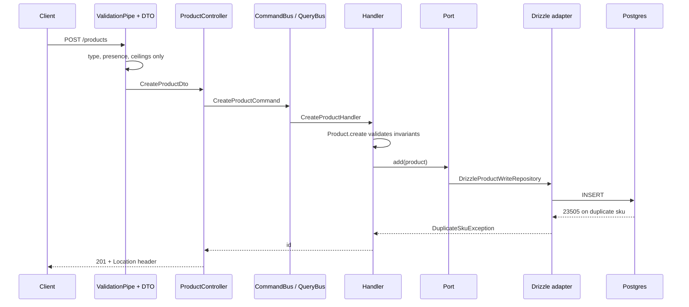

# Architecture

This file describes structure and flow: the four layers, how a request moves
through them, how an error surfaces, and the procedure for forking the
infrastructure layer onto a different database or ORM. Term definitions
(aggregate, port, contract test, and so on) live in
[`docs/concepts.md`](./concepts.md); this file links to them rather than
redefining them.

## Layers and enforcement

Dependencies point inward. ESLint enforces the boundaries, so a violation
fails the build rather than relying on discipline.

| Layer | Owns | May import |
| --- | --- | --- |
| `domain` | Aggregates, value objects, invariants | Nothing outside itself. No framework. |
| `application` | Commands, queries, handlers, ports | `domain` |
| `infrastructure` | Port implementations (Drizzle adapters) | `application`, `domain` |
| `presentation` | Controllers, DTOs, filters | `application` |

Commands operate on the `Product` aggregate. Queries never touch it; they
project rows into read models.

Each layer exposes a barrel (`index.ts`) as its public surface. Code inside a
layer imports by relative path, never through its own barrel: that cycle makes
a Nest injection token resolve to `undefined` and surfaces at boot as an
unrelated "can't resolve dependencies" error.

### Enforcement

[`eslint.config.mjs`](../eslint.config.mjs) carries four `no-restricted-imports`
blocks, one per layer that has something to forbid, plus the general
`import/no-cycle` rule that backs the barrel hazard above:

| Boundary | Enforced by |
| --- | --- |
| `domain` imports no `@nestjs/*` | `src/*/domain/**/*.ts` block, first pattern group |
| `domain` imports no `application`, `infrastructure`, or `presentation` | `src/*/domain/**/*.ts` block, second pattern group |
| `presentation` imports no domain entity, value object, or the domain barrel | `src/*/presentation/**/*.ts` block |
| `application` imports no `infrastructure` or `presentation` (no adapter, no controller) | `src/*/application/**/*.ts` block |
| `infrastructure` imports no `presentation` | `src/*/infrastructure/**/*.ts` block |

The presentation block has one deliberate carve-out: it names domain entities,
value objects, and the domain barrel specifically, not the domain layer as a
whole, so a direct import of a domain file that is none of those still
compiles. `src/shared/presentation/filters` relies on exactly that to import
`DomainException` and catch it.

## Request lifecycle

Walking each hop:

- The client posts to `/products`. `configureApp` in
  [`app.config.ts`](../src/app.config.ts) installs a global `ValidationPipe`
  that runs before any handler sees the request.
- The pipe validates the body against
  [`CreateProductDto`](../src/product/presentation/dtos/create-product.dto.ts)
  and, only on success, hands a `CreateProductDto` instance to
  [`ProductController.create`](../src/product/presentation/product.controller.ts).
- The controller dispatches a `CreateProductCommand` on Nest CQRS's
  `CommandBus`, which routes it to
  [`CreateProductHandler`](../src/product/application/use-cases/commands/create-product/create-product.handler.ts).
- The handler calls `Product.create`, which validates name, description, and
  stock before an instance exists, then calls `add` on the
  `ProductWriteRepository` port.
- [`DrizzleProductWriteRepository.add`](../src/product/infrastructure/adapters/drizzle-product.write-repository.ts)
  inserts the row. A duplicate SKU trips Postgres's unique constraint (SQLSTATE
  `23505`); the adapter walks the wrapped error's cause chain and raises
  `DuplicateSkuException` instead of letting a driver error escape.
- On the success path the handler returns only the new id, never the
  aggregate, and the controller sets a `Location` header pointing at the new
  resource before the framework serialises a 201.

Validation splits across two places on purpose:
[`CreateProductDto`](../src/product/presentation/dtos/create-product.dto.ts)
checks type, presence, and generous size ceilings, while
[`Product.create`](../src/product/domain/entities/product.entity.ts#L50-L66)
owns the rules (name length, non-empty description, integer non-negative
stock), so a rule is never written twice. See
[Invariant](./concepts.md#invariant) in the glossary for how the two layers
divide that work in general.

## Error path

| Failure | Base | Filter | Status |
| --- | --- | --- | --- |
| Broken invariant | `DomainException`, kind `invariant` | `DomainExceptionFilter` | 422 |
| Malformed identifier | `DomainException`, kind `malformed-identifier` | `DomainExceptionFilter` | 400 |
| Conflict, for example duplicate SKU | `ApplicationException`, kind `conflict` | `ApplicationExceptionFilter` | 409 |
| Not found | `ApplicationException`, kind `not-found` | `ApplicationExceptionFilter` | 404 |
| Anything unrecognised | none | `UnhandledExceptionFilter` | 500, no driver detail |

Every response body also carries a stable, machine-readable `code`, distinct
from the status above. `DomainExceptionFilter` and `ApplicationExceptionFilter`
both emit `{ statusCode, code, message }`, where `code` is `exception.code`; a
duplicate SKU comes back as
`{ statusCode: 409, code: 'PRODUCT_SKU_DUPLICATE', message: ... }`
([`duplicate-sku.exception.ts`](../src/product/application/exceptions/duplicate-sku.exception.ts)).
`UnhandledExceptionFilter` shapes its body the same way, with the fixed code
`'INTERNAL_ERROR'`. A status is shared by every failure of that kind, and a
message is prose free to be reworded; a client that needs to act on a
specific failure branches on `code`.

Verified against source: `conflict` maps to `HttpStatus.CONFLICT` (409) and
`not-found` maps to `HttpStatus.NOT_FOUND` (404) in
[`application-exception.filter.ts`](../src/shared/presentation/filters/application-exception.filter.ts),
matching
[`DuplicateSkuException`](../src/product/application/exceptions/duplicate-sku.exception.ts)'s
`conflict` kind and
[`ProductNotFoundException`](../src/product/application/exceptions/product-not-found.exception.ts)'s
`not-found` kind. The table above is unchanged from the plan.

`STATUS_BY_KIND` in
[`domain-exception.filter.ts`](../src/shared/presentation/filters/domain-exception.filter.ts)
is typed `Record<DomainErrorKind, HttpStatus>`, and `DomainErrorKind` is the
closed union `'invariant' | 'malformed-identifier'`. A `Record` over a union
type requires every member as a key, so adding a third kind without extending
the map fails compilation rather than falling through at runtime.
`application-exception.filter.ts` repeats the same shape for
`ApplicationErrorKind`. `UnhandledExceptionFilter` is the backstop: it is
registered with a bare `@Catch()`, so anything the two typed filters do not
claim lands there, and it logs the real error while returning a generic body
with no table, column, or SQL fragment.

## Fork seam

The application layer defines two ports in
[`src/product/application/ports/`](../src/product/application/ports/):
[`ProductReadRepository`](../src/product/application/ports/product.read-repository.ts)
and
[`ProductWriteRepository`](../src/product/application/ports/product.write-repository.ts).
Everything above them, controllers, DTOs, command and query handlers, is
written against these interfaces and knows nothing about Drizzle or Postgres.
Forking this repo onto a different database or ORM touches more than the two
adapters. It also replaces the module that provides their client and closes it
on shutdown, and it leaves behind a handful of files that are Drizzle-specific
by construction, not incidentally.

`drizzle.config.ts`, the `drizzle/` directory (the generated `*.sql`
migrations and their `meta/` snapshots), and
[`products.schema.ts`](../src/shared/infrastructure/database/postgres/schema/products.schema.ts)
belong to Drizzle and drizzle-kit specifically. A fork that keeps Drizzle but
targets a different database engine still needs new migrations for that
engine. A fork that drops Drizzle for another ORM replaces all three outright
with that ORM's own schema definition and migration format.

One coupling between them is easy to miss, and it fails silently rather than
loudly. The `sku` column's `.unique()` call in `products.schema.ts` is what
produces `CONSTRAINT "products_sku_unique" UNIQUE("sku")` in
[`drizzle/0000_lumpy_absorbing_man.sql`](../drizzle/0000_lumpy_absorbing_man.sql),
Drizzle's own naming convention for an unnamed unique constraint. The
`isDuplicateSku` check in
[`drizzle-product.write-repository.ts`](../src/product/infrastructure/adapters/drizzle-product.write-repository.ts#L49-L78)
matches that exact string against the constraint name on a `23505` error. A new
adapter that keeps a Postgres unique constraint on `sku`, but lets its own
schema tool name that constraint anything else, still rejects the duplicate
insert at the database; the equivalent duplicate-detection code just stops
recognising it, so the raw driver error escapes instead. The client gets a 500
from `UnhandledExceptionFilter` where it should get a 409 from
`DuplicateSkuException`, and the gap only shows up under concurrent writes.

The procedure:

1. Implement `ProductReadRepository` and `ProductWriteRepository` from
   `src/product/application/ports/`. Match each method's documented contract,
   not just its signature: `add` throws `DuplicateSkuException` on a colliding
   SKU rather than pre-checking, so two concurrent callers cannot both pass a
   check and then collide, which is why the constraint name above has to carry
   over deliberately rather than by accident. `delete` returns `false` rather
   than throwing when no row matched that id.
2. Provide your new database client and give it a Nest injection token,
   following
   [`drizzle.provider.ts`](../src/shared/infrastructure/database/postgres/drizzle.provider.ts).
   It defines two providers: one factory for the raw client (`POSTGRES_CLIENT`)
   and one for the ORM handle built from it (`DRIZZLE`), kept separate so
   something still holds a reference capable of closing the connection. Your
   two new adapters will `@Inject` whatever token you create here, not
   `DRIZZLE`.
3. Wrap the new provider(s) in an `@Global()` module modelled on
   [`drizzle.module.ts`](../src/shared/infrastructure/database/postgres/drizzle.module.ts),
   implementing `OnModuleDestroy` to close the new client. That module states
   why the hook lives on the module rather than the provider: "factory
   providers cannot carry lifecycle hooks." Skip this step and the new
   connection leaks on shutdown instead of closing.
4. Import the new module in
   [`src/app.module.ts`](../src/app.module.ts), which is where `DrizzleModule`
   itself is wired in today, not `product.module.ts`. `product.module.ts` only
   binds ports to adapters; it has no visibility into what those adapters need
   injected, and it is not where the client comes from.
5. Register the two adapters against `PRODUCT_READ_REPOSITORY` and
   `PRODUCT_WRITE_REPOSITORY` in
   [`src/product/product.module.ts`](../src/product/product.module.ts),
   replacing the `useClass: DrizzleProductReadRepository` and
   `useClass: DrizzleProductWriteRepository` providers. No command or query
   handler needs to change.
6. Write one binding file per contract suite. For the write side, follow
   [`test/contracts/product-write-repository.integration-spec.ts`](../test/contracts/product-write-repository.integration-spec.ts):
   supply a harness with `repository`, `reset()`, and `close()`. For the read
   side, follow
   [`product-read-repository.integration-spec.ts`](../test/contracts/product-read-repository.integration-spec.ts):
   its harness carries both `read` and `write` (seeding rows for a read test
   goes through the write port, so the contract never assumes how a row got
   there), plus the same `reset()` and `close()`. Point `reset` and `close` at
   whatever your adapter connects to.
7. Run `pnpm test:integration`.

The property that makes this safe: the contract suite is the port's
specification, not a suite that happens to exercise the Drizzle adapter. It
already runs twice, once against the in-memory fake and once against Drizzle,
and the in-memory fake is held to that exact same suite rather than trusted on
its own. An adapter that passes the same contract is substitutable by
construction; the rest of the codebase does not need to change, and nobody has
to re-derive correctness by reading the old adapter's code.
