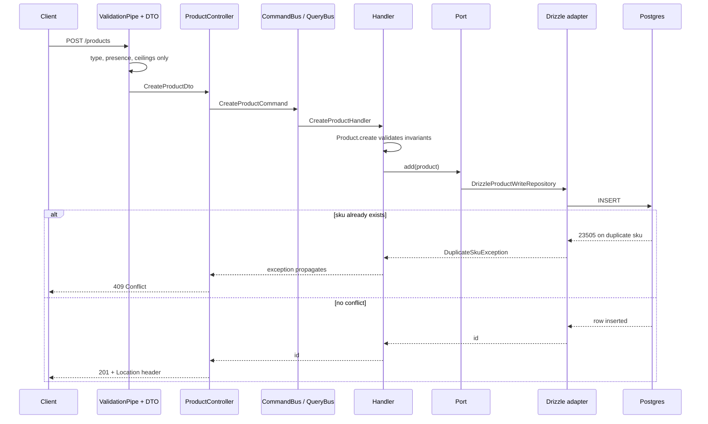

# Catalogue

The catalogue context: one aggregate, five endpoints, two ports. Layer rules,
the error mechanism, and the generic fork procedure live in
[`docs/architecture.md`](../architecture.md); this file carries only what is
specific to `src/catalogue/`.

## What it owns

[`Product`](../../src/catalogue/domain/entities/product.entity.ts) is the
aggregate and the whole consistency boundary.
[`Product.create`](../../src/catalogue/domain/entities/product.entity.ts) and
[`Product.replace`](../../src/catalogue/domain/entities/product.entity.ts) are
the only ways to construct one, over one shared validation path, `create`
minting an identity and `replace` taking one the caller already holds, so an
invalid `Product` is still never representable:

- Name: 2 to 255 characters after trimming.
- Description: non-empty after trimming.
- Stock: an integer, zero or greater.
- SKU: [`Sku.create`](../../src/catalogue/domain/value-objects/sku.vo.ts)
  uppercases and bounds length to between 3 and 50 characters.
- Price: [`Money.fromDecimal`](../../src/shared/domain/value-objects/money.vo.ts)
  from the shared kernel, stored as an integer count of minor units.

Catalogue also publishes one capability to other contexts,
[`StockAllocator`](../../src/catalogue/application/ports/stock-allocator.ts):
`allocate` decrements stock in one guarded statement per product and returns
the product snapshot with it, `release` adds stock back. Ordering consumes it
inside its own transaction; nothing in catalogue calls it.

## Endpoints

All five live on
[`ProductController`](../../src/catalogue/presentation/product.controller.ts) at
the `products` root.

| Method | Path | Success | Request DTO |
| --- | --- | --- | --- |
| POST | `/products` | 201, `Location: /products/{id}` | [`CreateProductDto`](../../src/catalogue/presentation/dtos/create-product.dto.ts) |
| GET | `/products` | 200, paginated | [`ListProductsQueryDto`](../../src/catalogue/presentation/dtos/list-products.query.dto.ts) |
| GET | `/products/:id` | 200 | [`ProductIdParamDto`](../../src/catalogue/presentation/dtos/product-id.param.dto.ts) |
| PUT | `/products/:id` | 204, no body | [`ProductIdParamDto`](../../src/catalogue/presentation/dtos/product-id.param.dto.ts), [`UpdateProductDto`](../../src/catalogue/presentation/dtos/update-product.dto.ts) |
| DELETE | `/products/:id` | 204, no body | [`ProductIdParamDto`](../../src/catalogue/presentation/dtos/product-id.param.dto.ts) |

## Ports and adapters

Ports are declared in
[`src/catalogue/application/ports/`](../../src/catalogue/application/ports/) and
bound to adapters in
[`catalogue.module.ts`](../../src/catalogue/catalogue.module.ts).

| Token | Interface | Adapter |
| --- | --- | --- |
| [`PRODUCT_READ_REPOSITORY`](../../src/catalogue/application/ports/product.read-repository.ts) | `ProductReadRepository` | [`DrizzleProductReadRepository`](../../src/catalogue/infrastructure/adapters/drizzle-product.read-repository.ts) |
| [`PRODUCT_WRITE_REPOSITORY`](../../src/catalogue/application/ports/product.write-repository.ts) | `ProductWriteRepository` | [`DrizzleProductWriteRepository`](../../src/catalogue/infrastructure/adapters/drizzle-product.write-repository.ts) |
| [`STOCK_ALLOCATOR`](../../src/catalogue/application/ports/stock-allocator.ts) | `StockAllocator` | [`DrizzleStockAllocator`](../../src/catalogue/infrastructure/adapters/drizzle-stock-allocator.ts) |

Each port has one contract suite with two bindings, one per implementation. The
mechanism, and why a fake is held to the same suite as the adapter, is in
[`docs/testing.md`](../testing.md#the-contract-mechanism).

| Contract | Fake binding, `unit` | Adapter binding, `integration` |
| --- | --- | --- |
| [`productWriteRepositoryContract`](../../test/contracts/product-write-repository.contract.ts) | [`product-write-repository.spec.ts`](../../test/contracts/product-write-repository.spec.ts) | [`product-write-repository.integration-spec.ts`](../../test/contracts/product-write-repository.integration-spec.ts) |
| [`productReadRepositoryContract`](../../test/contracts/product-read-repository.contract.ts) | [`product-read-repository.spec.ts`](../../test/contracts/product-read-repository.spec.ts) | [`product-read-repository.integration-spec.ts`](../../test/contracts/product-read-repository.integration-spec.ts) |
| [`stockAllocatorContract`](../../test/contracts/stock-allocator.contract.ts) | [`stock-allocator.spec.ts`](../../test/contracts/stock-allocator.spec.ts) | [`stock-allocator.integration-spec.ts`](../../test/contracts/stock-allocator.integration-spec.ts) |

Each fake binding constructs one in-memory repository:
[`InMemoryProductWriteRepository`](../../test/fakes/in-memory-product-write.repository.ts)
on the write side, and
[`InMemoryProductReadRepository`](../../test/fakes/in-memory-product-read.repository.ts)
on the read side, which projects from a write fake instance rather than
holding rows of its own. On both sides, `reset` clears that write fake's row
map and `close` is a no-op, since neither fake acquires anything to release.
Each adapter binding reaches the same shared test Postgres connection; `reset`
truncates the `products` table between tests and `close` ends that
connection.

Failure modes a fake cannot reproduce, such as a column type rejecting a value
Postgres cannot store, are covered outside the shared contract in
[`drizzle-product-write.integration-spec.ts`](../../test/contracts/drizzle-product-write.integration-spec.ts).
The allocator's two concurrency properties, no oversell and no deadlock, are
likewise adapter-only, in
[`drizzle-stock-allocator.integration-spec.ts`](../../test/contracts/drizzle-stock-allocator.integration-spec.ts):
the fake is single-threaded and cannot exhibit either.

## Request lifecycle

Walking each hop:

- The client posts to `/products`. `configureApp` in
  [`app.config.ts`](../../src/app.config.ts) installs a global `ValidationPipe`
  that runs before any handler sees the request.
- The pipe validates the body against
  [`CreateProductDto`](../../src/catalogue/presentation/dtos/create-product.dto.ts)
  and, only on success, hands an instance to
  [`ProductController.create`](../../src/catalogue/presentation/product.controller.ts).
- The controller dispatches a `CreateProductCommand` on Nest CQRS's
  `CommandBus`, which routes it to
  [`CreateProductHandler`](../../src/catalogue/application/use-cases/commands/create-product/create-product.handler.ts).
- The handler calls `Product.create`, which validates name, description, and
  stock before an instance exists, then calls `add` on the
  `ProductWriteRepository` port.
- [`DrizzleProductWriteRepository`](../../src/catalogue/infrastructure/adapters/drizzle-product.write-repository.ts)
  inserts the row. A duplicate SKU raises `DuplicateSkuException` rather than
  letting the driver error escape; see [Fork notes](#fork-notes) for the
  constraint name that detection depends on.
- On the success path the handler returns only the new id, never the aggregate,
  and the controller sets a `Location` header before the framework serialises
  a 201.

`PUT /products/:id` follows the same pipe and controller-to-bus path as
create, but differs after that.
[`ProductController.replace`](../../src/catalogue/presentation/product.controller.ts)
dispatches an `UpdateProductCommand`, and
[`UpdateProductHandler`](../../src/catalogue/application/use-cases/commands/update-product/update-product.handler.ts)
builds the aggregate through
[`Product.replace`](../../src/catalogue/domain/entities/product.entity.ts)
before the store is touched, so a request that breaks an invariant answers 422
even when the id holds nothing. The handler then calls
[`ProductWriteRepository.replace`](../../src/catalogue/application/ports/product.write-repository.ts),
which returns false rather than throwing when no row matched; the handler
turns that into `PRODUCT_NOT_FOUND`. Neither the handler nor the adapter sets
`updated_at`; the `products_set_updated_at` trigger moves it on every write,
including this one.

## Error codes

Codes raised by `src/catalogue/`. Shared kernel codes, `MONEY_INVALID` and
`IDENTIFIER_INVALID`, reach these endpoints too and are documented with the
error mechanism in
[`docs/architecture.md`](../architecture.md#error-path).

| Code | Kind | Status | Raised by |
| --- | --- | --- | --- |
| `PRODUCT_NAME_INVALID` | `invariant` | 422 | [`Product`](../../src/catalogue/domain/entities/product.entity.ts) |
| `PRODUCT_DESCRIPTION_INVALID` | `invariant` | 422 | [`Product`](../../src/catalogue/domain/entities/product.entity.ts) |
| `PRODUCT_STOCK_INVALID` | `invariant` | 422 | [`Product`](../../src/catalogue/domain/entities/product.entity.ts) |
| `PRODUCT_SKU_INVALID` | `invariant` | 422 | [`Sku.create`](../../src/catalogue/domain/value-objects/sku.vo.ts) |
| `PRODUCT_SKU_DUPLICATE` | `conflict` | 409 | [`DuplicateSkuException`](../../src/catalogue/application/exceptions/duplicate-sku.exception.ts) |
| `PRODUCT_NOT_FOUND` | `not-found` | 404 | [`GetProductHandler`](../../src/catalogue/application/use-cases/queries/get-product/get-product.handler.ts), [`DeleteProductHandler`](../../src/catalogue/application/use-cases/commands/delete-product/delete-product.handler.ts), [`UpdateProductHandler`](../../src/catalogue/application/use-cases/commands/update-product/update-product.handler.ts) |

## Fork notes

One coupling fails silently rather than loudly. The `sku` column's `.unique()`
call in
[`products.schema.ts`](../../src/shared/infrastructure/database/postgres/schema/products.schema.ts)
produces `CONSTRAINT "products_sku_unique" UNIQUE("sku")` in
[`drizzle/0000_lumpy_absorbing_man.sql`](../../drizzle/0000_lumpy_absorbing_man.sql),
Drizzle's naming convention for an unnamed unique constraint.
[`isDuplicateSku`](../../src/catalogue/infrastructure/adapters/drizzle-product.write-repository.ts)
matches that exact string against the constraint name on a `23505` error.

A new adapter that keeps a unique constraint on `sku` but lets its own schema
tool name it anything else still rejects the duplicate insert at the database;
the duplicate-detection code just stops recognising it, so the raw driver error
escapes. The client gets a 500 from `UnhandledExceptionFilter` where it should
get a 409, and the gap only shows up under concurrent writes.

A second coupling fails just as silently. `updated_at` is moved by the
`products_set_updated_at` trigger in
[`0002_updated_at_trigger.sql`](../../drizzle/0002_updated_at_trigger.sql),
not by application code, and no snapshot or schema file records that the
trigger exists. A fork that keeps the `updated_at` column but omits the
trigger leaves it frozen at insert time: no error anywhere, the same failure
shape as the constraint-name coupling above.

`products_stock_non_negative`, the check constraint on `stock`, is the
backstop behind the allocator's `stock >= $qty` guard. A fork that drops the
check keeps the guard and so keeps correctness, but loses the property that
negative stock is unrepresentable for any writer that bypasses the port.
[`DrizzleStockAllocator`](../../src/catalogue/infrastructure/adapters/drizzle-stock-allocator.ts)
also sorts requests by product id before touching a row; a fork that
processes them in request order deadlocks under concurrent orders that share
products.
