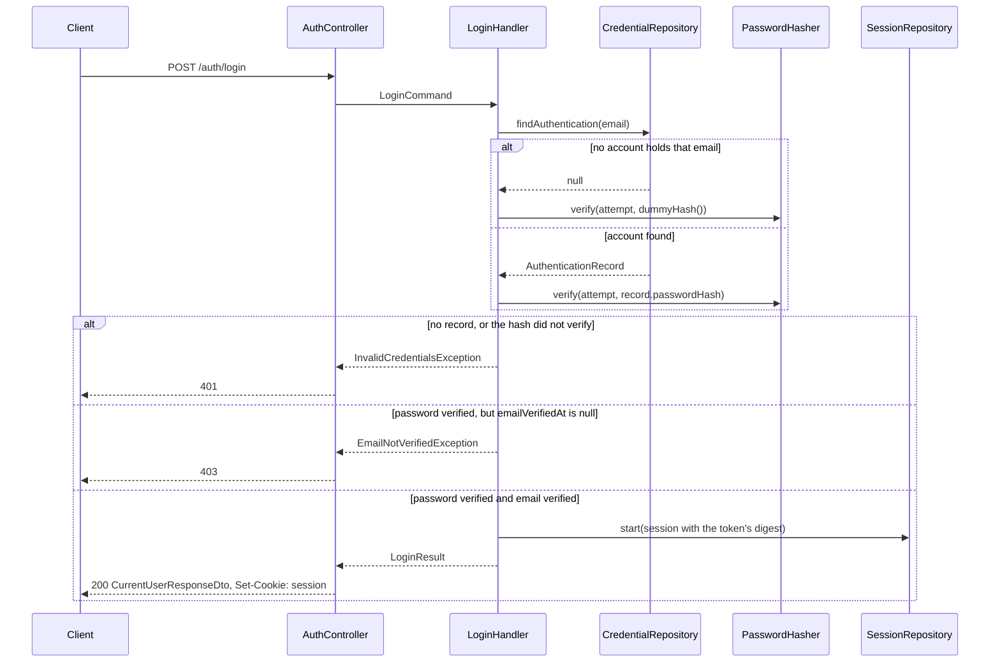

# Identity

The identity context: one aggregate, sixteen endpoints, seven ports. Layer
rules, the error mechanism, and the generic fork procedure live in
[`docs/architecture.md`](../architecture.md); this file carries only what is
specific to `src/identity/`.

## What it owns

[`User`](../../src/identity/domain/entities/user.entity.ts) is the aggregate
and the whole consistency boundary; its mutable fields live on
[`UserProfile`](../../src/identity/domain/value-objects/user-profile.vo.ts),
extracted so that email cannot change after registration (see
[ADR 0014](../adr/0014-email-is-immutable-after-registration.md)).
[`User.create`](../../src/identity/domain/entities/user.entity.ts) is the
only way to construct one, over one shared validation path:

- First and last name: 1 to 100 characters after trimming, owned by
  `UserProfile`.
- Email: [`Email.create`](../../src/identity/domain/value-objects/email.vo.ts)
  lowercases and bounds length to 254 characters.
- Role: [`UserRole.create`](../../src/identity/domain/value-objects/user-role.vo.ts)
  accepts only `customer` or `seller`.
- Phone: [`Phone.create`](../../src/identity/domain/value-objects/phone.vo.ts)
  normalises to a leading `+` and 8 to 15 digits. This is not E.164: country
  code and trunk prefix are not validated. Optional; absent means `null`.
- Password: [`Password.create`](../../src/identity/domain/value-objects/password.vo.ts)
  accepts 12 to 128 characters with no composition rules; length is the only
  property that reliably buys entropy once composition rules are off the
  table.

A credential, a session, and a one-time token are deliberately not modelled
as aggregates. None of their rows carries a cross-field invariant a
construction path would need to validate; each is a state machine on one to
three timestamp columns, guarded by the write itself rather than by a domain
object. See
[ADR 0013](../adr/0013-guarded-writes-never-rehydration.md) for the
mechanism and why a persistence factory was rejected.

Passwords are hashed with argon2id at
[`Argon2PasswordHasher`](../../src/identity/infrastructure/adapters/argon2-password.hasher.ts)'s
parameters: 19 MiB of memory, a time cost of 2, and a parallelism of 1,
OWASP's floor for the algorithm. Four TTLs govern how long an issued
credential stays usable, all configured, none hardcoded: how long a session
survives without a request (`SESSION_IDLE_TTL_DAYS`), how long a session lasts
however active it is (`SESSION_ABSOLUTE_TTL_DAYS`), how long a password reset
link works (`PASSWORD_RESET_TTL_MINUTES`), and how long an email verification
link works (`EMAIL_VERIFICATION_TTL_HOURS`).

## Endpoints

Sixteen endpoints across two controllers, both under
[`src/identity/presentation/`](../../src/identity/presentation/):
[`UserController`](../../src/identity/presentation/user.controller.ts) at the
`users` root, and
[`AuthController`](../../src/identity/presentation/auth.controller.ts) at
the `auth` root. The Guard column marks whether
[`SessionAuthGuard`](../../src/identity/presentation/guards/session-auth.guard.ts),
registered as `APP_GUARD`, requires a live session cookie; `Public` means the
[`Public`](../../src/shared/presentation/decorators/public.decorator.ts)
decorator opts the endpoint out. The Throttle column names the
`ThrottlerGuard` limit a `@Throttle` decorator sets on that endpoint,
`count/window`; `none` means no limit beyond `identity.module.ts`'s app-wide
default of 60 requests per 60 seconds. A caller over a named limit gets a 429
with no `code`, the same framework-exception shape
[`architecture.md`](../architecture.md#error-path) describes. Whatever the
column says, every request with an `Origin` header that is not
`WEB_BASE_URL`'s origin answers 403 `AUTH_ORIGIN_FORBIDDEN` before anything
else runs.

| Method | Path | Guard | Throttle | Success | Request DTO |
| --- | --- | --- | --- | --- | --- |
| POST | `/users` | Public | 5/hour | 201, `Location: /users/{id}` | [`RegisterUserDto`](../../src/identity/presentation/dtos/register-user.dto.ts) |
| GET | `/users` | Protected | none | 200, paginated | [`ListUsersQueryDto`](../../src/identity/presentation/dtos/list-users.query.dto.ts) |
| GET | `/users/:id` | Protected | none | 200 | [`UserIdParamDto`](../../src/identity/presentation/dtos/user-id.param.dto.ts) |
| PUT | `/users/:id` | Protected | none | 204, no body | [`UserIdParamDto`](../../src/identity/presentation/dtos/user-id.param.dto.ts), [`UpdateUserProfileDto`](../../src/identity/presentation/dtos/update-user-profile.dto.ts) |
| DELETE | `/users/:id` | Protected | none | 204, no body | [`UserIdParamDto`](../../src/identity/presentation/dtos/user-id.param.dto.ts) |
| POST | `/auth/login` | Public | 10/60s | 200, [`CurrentUserResponseDto`](../../src/identity/presentation/dtos/current-user-response.dto.ts), `Set-Cookie: session` | [`LoginDto`](../../src/identity/presentation/dtos/login.dto.ts) |
| GET | `/auth/me` | Protected | none | 200, `CurrentUserResponseDto` | none, the caller comes from the session the cookie names |
| POST | `/auth/verify-email` | Public | none | 204, no body | [`VerifyEmailDto`](../../src/identity/presentation/dtos/verify-email.dto.ts) |
| POST | `/auth/verify-email/resend` | Public | 5/hour | 202, no body | [`ResendVerificationDto`](../../src/identity/presentation/dtos/resend-verification.dto.ts) |
| POST | `/auth/logout` | Protected | none | 204, no body | none, the session comes from the cookie; the cookie is cleared |
| POST | `/auth/logout-all` | Protected | none | 204, no body | none, the user comes from the cookie; the cookie is cleared |
| GET | `/auth/sessions` | Protected | none | 200, [`SessionResponseDto`](../../src/identity/presentation/dtos/session-response.dto.ts) array, most recently seen first | none, the user comes from the cookie |
| DELETE | `/auth/sessions/:id` | Protected | none | 204, no body; the cookie is cleared when `:id` is the caller's own session | [`SessionIdParamDto`](../../src/identity/presentation/dtos/session-id.param.dto.ts) |
| POST | `/auth/forgot-password` | Public | 5/hour | 202, no body | [`ForgotPasswordDto`](../../src/identity/presentation/dtos/forgot-password.dto.ts) |
| POST | `/auth/reset-password` | Public | 10/60s | 204, no body | [`ResetPasswordDto`](../../src/identity/presentation/dtos/reset-password.dto.ts) |
| POST | `/auth/change-password` | Protected | 10/60s | 204, no body | [`ChangePasswordDto`](../../src/identity/presentation/dtos/change-password.dto.ts) |

Authentication and authorization are different concerns here, and only the
first is built for `/users`: any authenticated caller may act on any user, and
`GET /users` lists everyone with no ownership filter and no role check. See
[ADR 0015](../adr/0015-authentication-without-authorization.md) for why, and
what would change it. The two session endpoints are the one exception:
`GET /auth/sessions` lists only the caller's own sessions and
`DELETE /auth/sessions/:id` revokes only the caller's own, because the
repository predicate carries `user_id = caller` rather than a handler
comparing ids, so another user's session id answers the same 404 as a made-up
one.

Two more things this table does not say by itself. `POST /users` answering
409 on a duplicate email is an account-existence oracle: an unauthenticated
caller learns an address is registered without ever presenting a password.
That sits beside `POST /auth/login`, which answers a wrong password and an
unknown address identically (see [Request lifecycle](#request-lifecycle)
above), and `POST /auth/forgot-password`, which answers 202 regardless of
whether the address exists, both built specifically to avoid being that
oracle. The 409 is not a bug to fix: a clear "that email is taken" is what
makes registration usable, and the endpoint's own throttle limits how many
addresses a caller can probe. It is written here only so the system's
posture is stated, not implied by omission.

Second, every revocation reaches the very next request. `POST /auth/logout`,
`POST /auth/logout-all`, a password change or reset, and `DELETE /users/:id`
(through the `sessions.user_id` cascade) each answer by ending the session
rows involved, and `SessionAuthGuard` resolves the cookie against those rows
on every request, so there is no issued credential left to outlive its
revocation. The cost is one write per authenticated request, since the same
statement that checks liveness also moves `last_seen_at`;
`SESSION_IDLE_TTL_DAYS` and `SESSION_ABSOLUTE_TTL_DAYS` bound how long an
untouched or a very old session stays live. See
[ADR 0020](../adr/0020-server-side-sessions-replace-jwts.md) for the
credential model and
[ADR 0021](../adr/0021-cookie-transport-with-lax-and-origin-check.md) for
the cookie and the Origin check, including the constraint that the frontend
be same-site with the API.

## Ports and adapters

Ports are declared in
[`src/identity/application/ports/`](../../src/identity/application/ports/)
and bound to adapters in
[`identity.module.ts`](../../src/identity/identity.module.ts).

| Token | Interface | Adapter |
| --- | --- | --- |
| [`USER_READ_REPOSITORY`](../../src/identity/application/ports/user.read-repository.ts) | `UserReadRepository` | [`DrizzleUserReadRepository`](../../src/identity/infrastructure/adapters/drizzle-user.read-repository.ts) |
| [`USER_WRITE_REPOSITORY`](../../src/identity/application/ports/user.write-repository.ts) | `UserWriteRepository` | [`DrizzleUserWriteRepository`](../../src/identity/infrastructure/adapters/drizzle-user.write-repository.ts) |
| [`PASSWORD_HASHER`](../../src/identity/application/ports/password-hasher.ts) | `PasswordHasher` | [`Argon2PasswordHasher`](../../src/identity/infrastructure/adapters/argon2-password.hasher.ts) |
| [`CREDENTIAL_REPOSITORY`](../../src/identity/application/ports/credential.repository.ts) | `CredentialRepository` | [`DrizzleCredentialRepository`](../../src/identity/infrastructure/adapters/drizzle-credential.repository.ts) |
| [`ONE_TIME_TOKEN_REPOSITORY`](../../src/identity/application/ports/one-time-token.repository.ts) | `OneTimeTokenRepository` | [`DrizzleOneTimeTokenRepository`](../../src/identity/infrastructure/adapters/drizzle-one-time-token.repository.ts) |
| [`SESSION_REPOSITORY`](../../src/identity/application/ports/session.repository.ts) | `SessionRepository` | [`DrizzleSessionRepository`](../../src/identity/infrastructure/adapters/drizzle-session.repository.ts) |
| [`EMAIL_SENDER`](../../src/identity/application/ports/email.sender.ts) | `EmailSender` | [`SmtpEmailSender`](../../src/identity/infrastructure/adapters/smtp-email.sender.ts) |

`UserWriteRepository.register` replaced the old `add`: it writes the user,
its credential, and its first email-verification token in one transaction,
so a partial account is never persisted (see
[ADR 0013](../adr/0013-guarded-writes-never-rehydration.md)).
`UserWriteRepository.replaceProfile` replaced `replace`: it can never raise a
duplicate-email conflict, because email is not among the fields it writes
(see [ADR 0014](../adr/0014-email-is-immutable-after-registration.md)).

Each port has one contract suite with two bindings, one per implementation,
fourteen binding files in total. The mechanism, and why a fake is held to the
same suite as the adapter, is in
[`docs/testing.md`](../testing.md#the-contract-mechanism).

| Contract | Fake binding, `unit` | Adapter binding, `integration` |
| --- | --- | --- |
| [`userWriteRepositoryContract`](../../test/contracts/user-write-repository.contract.ts) | [`user-write-repository.spec.ts`](../../test/contracts/user-write-repository.spec.ts) | [`user-write-repository.integration-spec.ts`](../../test/contracts/user-write-repository.integration-spec.ts) |
| [`userReadRepositoryContract`](../../test/contracts/user-read-repository.contract.ts) | [`user-read-repository.spec.ts`](../../test/contracts/user-read-repository.spec.ts) | [`user-read-repository.integration-spec.ts`](../../test/contracts/user-read-repository.integration-spec.ts) |
| [`passwordHasherContract`](../../test/contracts/password-hasher.contract.ts) | [`password-hasher.spec.ts`](../../test/contracts/password-hasher.spec.ts) | [`password-hasher.integration-spec.ts`](../../test/contracts/password-hasher.integration-spec.ts) |
| [`credentialRepositoryContract`](../../test/contracts/credential-repository.contract.ts) | [`credential-repository.spec.ts`](../../test/contracts/credential-repository.spec.ts) | [`credential-repository.integration-spec.ts`](../../test/contracts/credential-repository.integration-spec.ts) |
| [`oneTimeTokenRepositoryContract`](../../test/contracts/one-time-token-repository.contract.ts) | [`one-time-token-repository.spec.ts`](../../test/contracts/one-time-token-repository.spec.ts) | [`one-time-token-repository.integration-spec.ts`](../../test/contracts/one-time-token-repository.integration-spec.ts) |
| [`sessionRepositoryContract`](../../test/contracts/session-repository.contract.ts) | [`session-repository.spec.ts`](../../test/contracts/session-repository.spec.ts) | [`session-repository.integration-spec.ts`](../../test/contracts/session-repository.integration-spec.ts) |
| [`emailSenderContract`](../../test/contracts/email-sender.contract.ts) | [`email-sender.spec.ts`](../../test/contracts/email-sender.spec.ts) | [`email-sender.integration-spec.ts`](../../test/contracts/email-sender.integration-spec.ts) |

Each fake binding constructs one in-memory or recording double:
[`InMemoryUserWriteRepository`](../../test/fakes/in-memory-user-write.repository.ts)
and
[`InMemoryUserReadRepository`](../../test/fakes/in-memory-user-read.repository.ts)
predate this feature; [`FakePasswordHasher`](../../test/fakes/fake-password.hasher.ts),
[`InMemoryCredentialRepository`](../../test/fakes/in-memory-credential.repository.ts),
[`InMemoryOneTimeTokenRepository`](../../test/fakes/in-memory-one-time-token.repository.ts),
[`InMemorySessionRepository`](../../test/fakes/in-memory-session.repository.ts),
and [`RecordingEmailSender`](../../test/fakes/recording-email.sender.ts) are new.
`reset` clears whatever row map or record the fake holds and `close` is a
no-op, since none of these fakes acquires anything to release. Most adapter
bindings reach the same shared test Postgres connection; `reset` truncates
the relevant table and `close` ends that connection. The email-sender
adapter binding is the exception: it starts its own Mailpit container in a
`beforeAll` rather than using the `integration` project's shared
`globalSetup`, since it is the only suite that needs Mailpit (see
[`docs/testing.md`](../testing.md#the-contract-mechanism)).

Failure modes a fake cannot reproduce are covered outside the shared
contracts. The `users_set_updated_at` trigger moving `updated_at` on a real
`replaceProfile` is covered in
[`drizzle-user-write.integration-spec.ts`](../../test/contracts/drizzle-user-write.integration-spec.ts).
The `users` cascade removing a user's sessions is covered in
[`drizzle-session.integration-spec.ts`](../../test/contracts/drizzle-session.integration-spec.ts),
since the fake models no `users` table.

## Request lifecycle

Registration writes three rows in one transaction and sends mail only after
that transaction commits:

```mermaid
sequenceDiagram
    participant C as Client
    participant V as ValidationPipe + DTO
    participant Ctl as UserController
    participant B as CommandBus
    participant H as RegisterUserHandler
    participant Hash as PasswordHasher
    participant P as UserWriteRepository
    participant A as Drizzle adapter
    participant DB as Postgres
    participant E as EmailSender

    C->>V: POST /users
    V->>V: type, presence, ceilings only
    V->>Ctl: RegisterUserDto
    Ctl->>B: RegisterUserCommand
    B->>H: RegisterUserHandler
    H->>Hash: hash(Password.create(password))
    H->>H: User.create validates invariants
    H->>P: register({ user, passwordHash, verification })
    P->>A: DrizzleUserWriteRepository
    A->>DB: BEGIN
    A->>DB: INSERT users
    A->>DB: INSERT credentials
    A->>DB: INSERT one_time_tokens
    alt email already exists
        DB-->>A: 23505 on duplicate email
        A-->>H: DuplicateEmailException
        H-->>Ctl: exception propagates
        Ctl-->>C: 409 Conflict
    else no conflict
        DB-->>A: COMMIT
        A-->>H: id
        H->>E: sendEmailVerification(email, token)
        Note over H,E: after commit; a send failure is logged,<br/>never rolls back or fails the request
        H-->>Ctl: id
        Ctl-->>C: 201 + Location header
    end
```

Walking each hop:

- The client posts to `/users`. `configureApp` in
  [`app.config.ts`](../../src/app.config.ts) installs a global
  `ValidationPipe` that runs before any handler sees the request.
- The pipe validates the body against
  [`RegisterUserDto`](../../src/identity/presentation/dtos/register-user.dto.ts)
  and, only on success, hands an instance to
  [`UserController.create`](../../src/identity/presentation/user.controller.ts).
- The controller dispatches a `RegisterUserCommand` on Nest CQRS's
  `CommandBus`, which routes it to
  [`RegisterUserHandler`](../../src/identity/application/use-cases/commands/register-user/register-user.handler.ts).
- The handler validates and hashes the password before touching the store,
  so a policy rejection costs nothing, then calls `User.create`, which
  validates the name, email, role, and phone before an instance exists.
- [`DrizzleUserWriteRepository.register`](../../src/identity/infrastructure/adapters/drizzle-user.write-repository.ts)
  inserts all three rows in one transaction. A duplicate email raises
  `DuplicateEmailException` rather than letting the driver error escape; see
  [Fork notes](#fork-notes) for the constraint name that detection depends
  on.
- Only once that transaction commits does the handler call
  `EmailSender.sendEmailVerification`; a rejected send is logged and does
  not fail the request or undo the write (see
  [ADR 0018](../adr/0018-mail-sent-inline-after-commit.md)).
- On the success path the handler returns only the new id, never the
  aggregate, and the controller sets a `Location` header before the
  framework serialises a 201.

`PUT /users/:id` follows the same pipe and controller-to-bus path, but
differs after that.
[`UserController.replace`](../../src/identity/presentation/user.controller.ts)
dispatches an `UpdateUserCommand`, and
[`UpdateUserHandler`](../../src/identity/application/use-cases/commands/update-user/update-user.handler.ts)
builds a profile through
[`UserProfile.create`](../../src/identity/domain/value-objects/user-profile.vo.ts)
before the store is touched, so a request that breaks an invariant answers
422 even when the id holds nothing. The handler then calls
[`UserWriteRepository.replaceProfile`](../../src/identity/application/ports/user.write-repository.ts),
which returns false rather than throwing when no row matched; the handler
turns that into `USER_NOT_FOUND`. Neither the handler nor the adapter sets
`updated_at`; the `users_set_updated_at` trigger moves it on every write,
including this one.

Login checks a password against a stored hash, then a verification flag,
in that order:



Two details on this path are not inferable from the diagram's shape alone.
First, a login attempt against an email nobody holds still spends one full
argon2 verification, against
[`PasswordHasher.dummyHash`](../../src/identity/application/ports/password-hasher.ts),
a hash no attempt can ever match but whose verification costs what a real
one costs; without it, an unknown address would answer faster than a known
one with a wrong password, and response timing alone would reveal which
addresses have accounts. Second, `EmailNotVerifiedException` is only
possible after the password has already verified: an attacker who has
guessed an address but not its password sees the same `401` as any other
wrong guess, and cannot use this endpoint to confirm the account exists.

Every protected request resolves the cookie against the `sessions` table in
one statement that is both the liveness check and the idle-window extension:

```mermaid
sequenceDiagram
    participant B as Browser
    participant G as SessionAuthGuard
    participant H as AuthenticateSessionHandler
    participant S as SessionRepository
    participant DB as Postgres
    participant Ctl as Controller

    B->>G: request with cookie `session`
    G->>G: Origin present and not WEB_BASE_URL's? 403
    G->>G: @Public()? pass through
    G->>G: no cookie? 401
    G->>H: AuthenticateSessionCommand(plaintext)
    H->>S: touch(SecretToken.hashOf(plaintext), now)
    S->>DB: UPDATE sessions SET last_seen_at = now FROM users<br/>WHERE token_hash = digest AND revoked_at IS NULL<br/>AND last_seen_at > now - idle AND created_at > now - absolute<br/>RETURNING id, user_id, role
    alt no row
        S-->>H: null
        H-->>G: null
        G-->>B: 401 AUTH_UNAUTHENTICATED
    else row
        S-->>H: { userId, role, sessionId }
        H-->>G: AuthenticatedSession
        G->>G: request.user = session; Set-Cookie with a fresh Max-Age
        G->>Ctl: proceed
    end
```

The guard dispatches a command rather than calling the port because hashing
the presented token is `SecretToken.hashOf`, a domain operation presentation
may not perform. The `UPDATE` is guarded in the sense of
[ADR 0013](../adr/0013-guarded-writes-never-rehydration.md): a session revoked
between two requests cannot be extended by the second, because the revocation
changed the row the guard tests. Unknown, revoked, idle-expired and absolutely
expired all answer the same 401, since telling a forger which check failed is
a gift.

## Error codes

Codes raised by `src/identity/`.

| Code | Kind | Status | Raised by |
| --- | --- | --- | --- |
| `USER_NAME_INVALID` | `invariant` | 422 | [`UserProfile`](../../src/identity/domain/value-objects/user-profile.vo.ts) |
| `USER_EMAIL_INVALID` | `invariant` | 422 | [`Email.create`](../../src/identity/domain/value-objects/email.vo.ts) |
| `USER_PHONE_INVALID` | `invariant` | 422 | [`Phone.create`](../../src/identity/domain/value-objects/phone.vo.ts) |
| `USER_ROLE_INVALID` | `invariant` | 422 | [`UserRole.create`](../../src/identity/domain/value-objects/user-role.vo.ts) |
| `USER_PASSWORD_INVALID` | `invariant` | 422 | [`Password`](../../src/identity/domain/value-objects/password.vo.ts), [`PasswordAttempt`](../../src/identity/domain/value-objects/password.vo.ts), [`PasswordHash`](../../src/identity/domain/value-objects/password-hash.vo.ts) |
| `USER_TOKEN_PURPOSE_INVALID` | `invariant` | 422 | [`TokenPurpose`](../../src/identity/domain/value-objects/token-purpose.vo.ts) |
| `USER_TOKEN_HASH_INVALID` | `invariant` | 422 | [`TokenHash`](../../src/identity/domain/value-objects/token-hash.vo.ts) |
| `USER_EMAIL_DUPLICATE` | `conflict` | 409 | [`DuplicateEmailException`](../../src/identity/application/exceptions/duplicate-email.exception.ts) |
| `USER_NOT_FOUND` | `not-found` | 404 | [`GetUserHandler`](../../src/identity/application/use-cases/queries/get-user/get-user.handler.ts), [`DeleteUserHandler`](../../src/identity/application/use-cases/commands/delete-user/delete-user.handler.ts), [`UpdateUserHandler`](../../src/identity/application/use-cases/commands/update-user/update-user.handler.ts) |
| `AUTH_SESSION_NOT_FOUND` | `not-found` | 404 | [`RevokeSessionHandler`](../../src/identity/application/use-cases/commands/revoke-session/revoke-session.handler.ts) |
| `AUTH_UNAUTHENTICATED` | `unauthorized` | 401 | [`SessionAuthGuard`](../../src/identity/presentation/guards/session-auth.guard.ts) |
| `AUTH_ORIGIN_FORBIDDEN` | `forbidden` | 403 | [`SessionAuthGuard`](../../src/identity/presentation/guards/session-auth.guard.ts) |
| `AUTH_INVALID_CREDENTIALS` | `unauthorized` | 401 | [`LoginHandler`](../../src/identity/application/use-cases/commands/login/login.handler.ts), [`ChangePasswordHandler`](../../src/identity/application/use-cases/commands/change-password/change-password.handler.ts) |
| `AUTH_EMAIL_NOT_VERIFIED` | `forbidden` | 403 | [`LoginHandler`](../../src/identity/application/use-cases/commands/login/login.handler.ts) |
| `AUTH_RESET_TOKEN_EXPIRED` | `unauthorized` | 401 | [`ResetPasswordHandler`](../../src/identity/application/use-cases/commands/reset-password/reset-password.handler.ts) |
| `AUTH_RESET_TOKEN_INVALID` | `unauthorized` | 401 | [`ResetPasswordHandler`](../../src/identity/application/use-cases/commands/reset-password/reset-password.handler.ts) |
| `AUTH_VERIFICATION_TOKEN_EXPIRED` | `unauthorized` | 401 | [`VerifyEmailHandler`](../../src/identity/application/use-cases/commands/verify-email/verify-email.handler.ts) |
| `AUTH_VERIFICATION_TOKEN_INVALID` | `unauthorized` | 401 | [`VerifyEmailHandler`](../../src/identity/application/use-cases/commands/verify-email/verify-email.handler.ts) |

`AUTH_RESET_TOKEN_EXPIRED`/`INVALID` and `AUTH_VERIFICATION_TOKEN_EXPIRED`/`INVALID`
are deliberately two codes apiece rather than one: both tokens reach the
account owner's inbox, so telling the holder "expired, request another"
leaks nothing to anyone who does not already hold the link, and collapsing
the two would make a routine expiry read as a broken one.
`AUTH_UNAUTHENTICATED` deliberately does the opposite, one code for every
failure mode (no cookie, unknown, revoked, idle-expired, absolutely expired),
because a session cookie is held by whoever presents it, not delivered to an
inbox, so naming which check fired would tell a forger which part to fix.

## Fork notes

Two couplings fail silently rather than loudly, both pre-dating this
feature. The `email` column's `.unique()` call in
[`users.schema.ts`](../../src/shared/infrastructure/database/postgres/schema/users.schema.ts)
produces `CONSTRAINT "users_email_unique" UNIQUE("email")` in
[`drizzle/0003_users_table.sql`](../../drizzle/0003_users_table.sql), and
[`isDuplicateEmail`](../../src/identity/infrastructure/adapters/drizzle-user.write-repository.ts)
matches that exact string on a `23505` error. A fork whose schema tool names
the constraint anything else still rejects the duplicate insert; the
detection just stops recognising it, so the raw driver error escapes as a
500 where a 409 was expected, the same failure shape
[ADR 0003](../adr/0003-sku-uniqueness-arbitrated-by-the-database.md) records
for SKU. `updated_at` is moved by the `users_set_updated_at` trigger in
[`0004_users_updated_at_trigger.sql`](../../drizzle/0004_users_updated_at_trigger.sql),
not by application code, and no snapshot records that the trigger exists; a
fork that keeps the column but omits the trigger leaves it frozen at insert
time with no error anywhere. [ADR 0009](../adr/0009-postgres-owns-updated-at.md)
records why the database owns the column.

Two couplings are new with authentication. The `token_purpose` Postgres enum
in
[`one-time-tokens.schema.ts`](../../src/shared/infrastructure/database/postgres/schema/one-time-tokens.schema.ts)
duplicates the value set
[`TokenPurpose`](../../src/identity/domain/value-objects/token-purpose.vo.ts)
closes over, by hand, with nothing enforcing the two stay equal; a third
purpose added to one without the other compiles cleanly and fails only at
insert time, the same shape `user_role` already carries for `UserRole`.

Registration's guarantee, that a user, its credential, and its first
verification token always exist together, is transactional rather than
declarative: nothing in the schema stops a row existing without the others,
only
[`DrizzleUserWriteRepository.register`](../../src/identity/infrastructure/adapters/drizzle-user.write-repository.ts)
wrapping all three inserts in one transaction does. A fork whose adapter
drops that transaction, issuing three separate inserts instead, can persist
a `users` row with no matching `credentials` row, and that user can never
log in again, with no error anywhere to surface the gap; see
[ADR 0013](../adr/0013-guarded-writes-never-rehydration.md).

Three couplings are new with sessions. `sessions.token_hash` is `varchar(64)`
and must stay equal to `TokenHash.LENGTH`, the same by-hand coupling
`one_time_tokens.token_hash` carries. `sessions.user_agent` and
`sessions.ip_address` are `text` on purpose, so there is no column length for
[`originOf`](../../src/identity/presentation/request-origin.ts)'s ceilings to
drift from. Liveness has no column at all: a fork that adds an `expires_at`
and computes it once at login reintroduces the frozen-TTL behaviour
[ADR 0020](../adr/0020-server-side-sessions-replace-jwts.md) rejects, with
nothing failing to say so.

`credentials` has no `updated_at` column and therefore no trigger, and that
absence is deliberate, not an oversight of the `updated_at` coupling above:
nothing reads a mutation timestamp for a credential, and the comment on
[`credentials.schema.ts`](../../src/shared/infrastructure/database/postgres/schema/credentials.schema.ts)
states this directly so the missing trigger is not mistaken for the
[ADR 0009](../adr/0009-postgres-owns-updated-at.md) hazard the two
`updated_at` couplings above describe.

`Password`, `PasswordAttempt`, and `SecretToken` redact themselves when
serialised, which stops a logged aggregate or read model from carrying one in
the clear. That protection stops at the presentation boundary: a command may
not import a domain value object, so
[`LoginCommand.password`](../../src/identity/application/use-cases/commands/login/login.command.ts),
[`ChangePasswordCommand.currentPassword`](../../src/identity/application/use-cases/commands/change-password/change-password.command.ts)
and `newPassword`,
[`ResetPasswordCommand.token`](../../src/identity/application/use-cases/commands/reset-password/reset-password.command.ts)
and `newPassword`, and
[`AuthenticateSessionCommand.presentedToken`](../../src/identity/application/use-cases/commands/authenticate-session/authenticate-session.command.ts)
are raw public strings, each carrying only its own interface comment as a
warning. `presentedToken` is dispatched on every protected request carrying a
live credential, so a logging interceptor would leak far more here than at
login, one command per request rather than one per login. The same risk sits
on the way out:
[`LoginResult.token`](../../src/identity/application/use-cases/commands/login/login.handler.ts)
is the plaintext the controller writes into `Set-Cookie`, held in a plain
string for the same presentation-boundary reason as the commands above.
Nothing logs a command today, so there is no live leak, but a CQRS logging
interceptor added later would put a plaintext password in every log line it
touched, and no test here would go red to catch it.
