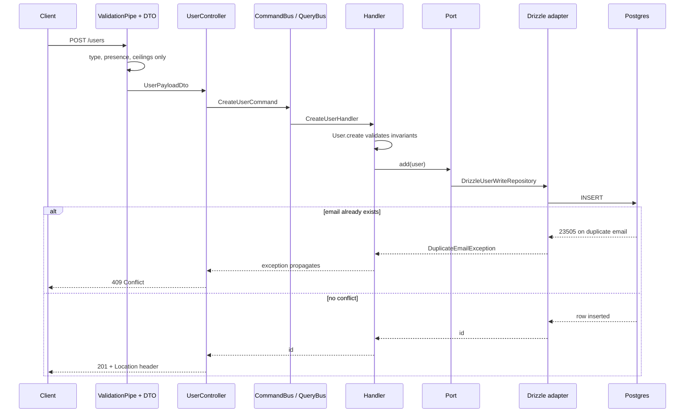

# Identity

The identity context: one aggregate, five endpoints, two ports. Layer rules, the error
mechanism, and the generic fork procedure live in
[`docs/architecture.md`](../architecture.md); this file carries only what is
specific to `src/identity/`.

## What it owns

[`User`](../../src/identity/domain/entities/user.entity.ts) is the aggregate and
the whole consistency boundary. [`User.create`](../../src/identity/domain/entities/user.entity.ts)
is the only way to construct one, over one shared validation path:

- First and last name: 1 to 100 characters after trimming.
- Email: [`Email.create`](../../src/identity/domain/value-objects/email.vo.ts)
  lowercases and bounds length to 254 characters.
- Role: [`UserRole.create`](../../src/identity/domain/value-objects/user-role.vo.ts)
  accepts only `customer` or `seller`.
- Phone: [`Phone.create`](../../src/identity/domain/value-objects/phone.vo.ts)
  normalises to a leading `+` and 8 to 15 digits. This is not E.164: country
  code and trunk prefix are not validated. Optional; absent means `null`.

## Endpoints

All five live on
[`UserController`](../../src/identity/presentation/user.controller.ts) at the
`users` root.

| Method | Path | Success | Request DTO |
| --- | --- | --- | --- |
| POST | `/users` | 201, `Location: /users/{id}` | [`RegisterUserDto`](../../src/identity/presentation/dtos/register-user.dto.ts) |
| GET | `/users` | 200, paginated | [`ListUsersQueryDto`](../../src/identity/presentation/dtos/list-users.query.dto.ts) |
| GET | `/users/:id` | 200 | [`UserIdParamDto`](../../src/identity/presentation/dtos/user-id.param.dto.ts) |
| PUT | `/users/:id` | 204, no body | [`UserIdParamDto`](../../src/identity/presentation/dtos/user-id.param.dto.ts), [`UpdateUserProfileDto`](../../src/identity/presentation/dtos/update-user-profile.dto.ts) |
| DELETE | `/users/:id` | 204, no body | [`UserIdParamDto`](../../src/identity/presentation/dtos/user-id.param.dto.ts) |

## Ports and adapters

Ports are declared in
[`src/identity/application/ports/`](../../src/identity/application/ports/) and bound
to adapters in [`identity.module.ts`](../../src/identity/identity.module.ts).

| Token | Interface | Adapter |
| --- | --- | --- |
| [`USER_READ_REPOSITORY`](../../src/identity/application/ports/user.read-repository.ts) | `UserReadRepository` | [`DrizzleUserReadRepository`](../../src/identity/infrastructure/adapters/drizzle-user.read-repository.ts) |
| [`USER_WRITE_REPOSITORY`](../../src/identity/application/ports/user.write-repository.ts) | `UserWriteRepository` | [`DrizzleUserWriteRepository`](../../src/identity/infrastructure/adapters/drizzle-user.write-repository.ts) |

Each port has one contract suite with two bindings, one per implementation. The
mechanism, and why a fake is held to the same suite as the adapter, is in
[`docs/testing.md`](../testing.md#the-contract-mechanism).

| Contract | Fake binding, `unit` | Adapter binding, `integration` |
| --- | --- | --- |
| [`userWriteRepositoryContract`](../../test/contracts/user-write-repository.contract.ts) | [`user-write-repository.spec.ts`](../../test/contracts/user-write-repository.spec.ts) | [`user-write-repository.integration-spec.ts`](../../test/contracts/user-write-repository.integration-spec.ts) |
| [`userReadRepositoryContract`](../../test/contracts/user-read-repository.contract.ts) | [`user-read-repository.spec.ts`](../../test/contracts/user-read-repository.spec.ts) | [`user-read-repository.integration-spec.ts`](../../test/contracts/user-read-repository.integration-spec.ts) |

Each fake binding constructs one in-memory repository:
[`InMemoryUserWriteRepository`](../../test/fakes/in-memory-user-write.repository.ts)
on the write side, and
[`InMemoryUserReadRepository`](../../test/fakes/in-memory-user-read.repository.ts)
on the read side, which projects from a write fake instance rather than
holding rows of its own. `reset` clears that write fake's row map and `close`
is a no-op, since neither fake acquires anything to release. Each adapter
binding reaches the same shared test Postgres connection; `reset` truncates
the `users` table between tests and `close` ends that connection.

Failure modes a fake cannot reproduce, such as the `users_set_updated_at`
trigger moving `updated_at` on a real `replaceProfile`, are covered outside the
shared contract in
[`drizzle-user-write.integration-spec.ts`](../../test/contracts/drizzle-user-write.integration-spec.ts).

## Request lifecycle

Walking each hop:

- The client posts to `/users`. `configureApp` in
  [`app.config.ts`](../../src/app.config.ts) installs a global `ValidationPipe`
  that runs before any handler sees the request.
- The pipe validates the body against
  [`RegisterUserDto`](../../src/identity/presentation/dtos/register-user.dto.ts) and,
  only on success, hands an instance to
  [`UserController.create`](../../src/identity/presentation/user.controller.ts).
- The controller dispatches a `CreateUserCommand` on Nest CQRS's `CommandBus`,
  which routes it to
  [`RegisterUserHandler`](../../src/identity/application/use-cases/commands/register-user/register-user.handler.ts).
- The handler calls `User.create`, which validates the name, email, role, and
  phone before an instance exists, then calls `add` on the
  `UserWriteRepository` port.
- [`DrizzleUserWriteRepository`](../../src/identity/infrastructure/adapters/drizzle-user.write-repository.ts)
  inserts the row. A duplicate email raises `DuplicateEmailException` rather
  than letting the driver error escape; see [Fork notes](#fork-notes) for the
  constraint name that detection depends on.
- On the success path the handler returns only the new id, never the
  aggregate, and the controller sets a `Location` header before the framework
  serialises a 201.

`PUT /users/:id` follows the same pipe and controller-to-bus path as create,
but differs after that.
[`UserController.replace`](../../src/identity/presentation/user.controller.ts)
dispatches an `UpdateUserCommand`, and
[`UpdateUserHandler`](../../src/identity/application/use-cases/commands/update-user/update-user.handler.ts)
builds a profile through
[`UserProfile.create`](../../src/identity/domain/value-objects/user-profile.vo.ts) before the
store is touched, so a request that breaks an invariant answers 422 even when
the id holds nothing. The handler then calls
[`UserWriteRepository.replaceProfile`](../../src/identity/application/ports/user.write-repository.ts),
which returns false rather than throwing when no row matched; the handler
turns that into `USER_NOT_FOUND`. Neither the handler nor the adapter sets
`updated_at`; the `users_set_updated_at` trigger moves it on every write,
including this one.

## Error codes

Codes raised by `src/identity/`.

| Code | Kind | Status | Raised by |
| --- | --- | --- | --- |
| `USER_NAME_INVALID` | `invariant` | 422 | [`User`](../../src/identity/domain/entities/user.entity.ts) |
| `USER_EMAIL_INVALID` | `invariant` | 422 | [`Email.create`](../../src/identity/domain/value-objects/email.vo.ts) |
| `USER_PHONE_INVALID` | `invariant` | 422 | [`Phone.create`](../../src/identity/domain/value-objects/phone.vo.ts) |
| `USER_ROLE_INVALID` | `invariant` | 422 | [`UserRole.create`](../../src/identity/domain/value-objects/user-role.vo.ts) |
| `USER_EMAIL_DUPLICATE` | `conflict` | 409 | [`DuplicateEmailException`](../../src/identity/application/exceptions/duplicate-email.exception.ts) |
| `USER_NOT_FOUND` | `not-found` | 404 | [`GetUserHandler`](../../src/identity/application/use-cases/queries/get-user/get-user.handler.ts), [`DeleteUserHandler`](../../src/identity/application/use-cases/commands/delete-user/delete-user.handler.ts), [`UpdateUserHandler`](../../src/identity/application/use-cases/commands/update-user/update-user.handler.ts) |

## Fork notes

One coupling fails silently rather than loudly. The `email` column's
`.unique()` call in
[`users.schema.ts`](../../src/shared/infrastructure/database/postgres/schema/users.schema.ts)
produces `CONSTRAINT "users_email_unique" UNIQUE("email")` in
[`drizzle/0003_users_table.sql`](../../drizzle/0003_users_table.sql), Drizzle's
naming convention for an unnamed unique constraint.
[`isDuplicateEmail`](../../src/identity/infrastructure/adapters/drizzle-user.write-repository.ts)
matches that exact string against the constraint name on a `23505` error.

A new adapter that keeps a unique constraint on `email` but lets its own
schema tool name it anything else still rejects the duplicate insert at the
database; the duplicate-detection code just stops recognising it, so the raw
driver error escapes. The client gets a 500 from `UnhandledExceptionFilter`
where it should get a 409, and the gap only shows up under concurrent writes,
the same failure shape [ADR 0003](../adr/0003-sku-uniqueness-arbitrated-by-the-database.md)
records for SKU.

A second coupling fails just as silently. `updated_at` is moved by the
`users_set_updated_at` trigger in
[`0004_users_updated_at_trigger.sql`](../../drizzle/0004_users_updated_at_trigger.sql),
not by application code, and no snapshot or schema file records that the
trigger exists. A fork that keeps the `updated_at` column but omits the
trigger leaves it frozen at insert time: no error anywhere, the same failure
shape as the constraint-name coupling above.
[ADR 0009](../adr/0009-postgres-owns-updated-at.md) records why the database
owns the column instead of the write adapter.
